# Steps, suspension and mailbox coordination

This tranche extends the explicit dependency protocol with resumable steps and a .NET mailbox coordinator. It builds on the 46-test `affb92d206242a21fc2032d51016cd0f29e7e54f` checkpoint. The current Release suite passed 77/77 tests: those 46 controls, 13 new core suspension cases and 18 mailbox cases. A targeted mutation demonstrated that the callback-capacity test detects premature slot release; the restored implementation passed the complete suite again. See the [auditor checkpoint](Mailbox_Auditor_Checkpoint.md) for evidence and review limits. Composer and Bozzetto adoption remain separate work.

The inspiration is a separation of computation from execution. Syme, Petricek and Lomov's [F# asynchronous programming model](https://www.microsoft.com/en-us/research/wp-content/uploads/2016/02/async-padl-revised-v2.pdf) describes suspended computations, cooperative cancellation and mailbox-driven state machines. It also distinguishes asynchronous waits from ordinary synchronous code, which cannot be interrupted by adding an asynchronous wrapper. Petricek and Syme's [Computation Expression Zoo](https://www.microsoft.com/en-us/research/wp-content/uploads/2016/02/computation-zoo.pdf) explains how a builder's operations determine its semantics. Familiar syntax is therefore not evidence that a new builder preserves cancellation, resource ownership or sequencing laws. This tranche introduces explicit data and protocol operations, not a general-purpose computation-expression builder.

## A suspended attempt remains owned

`SuspensionHandle` contains `Epoch`, `Attempt`, fresh `Id`, `Step` and `Environment`. The environment is an owner-issued `ValueToken` referring only to immutable data. It is not a captured task, stack, lock, lease, stream or native resource. `ResumeRequest` combines the original `StartRequest`, the exact suspension handle, and a response token.

These public data handles enforce protocol identity and freshness; they are not security capabilities. Exact matching and one-shot consumption do not authenticate a caller or isolate untrusted code. Any external access-control boundary belongs to the integrating owner.

Environment and response tokens do **not** register dependencies. Every semantic input that gives those tokens meaning must already be covered by the definition's complete declared reads and stamps, including census or whole-revision inputs where necessary. If that meaning changes, the owner must invalidate the corresponding work. Receiving a response does not silently extend the read set or make old premises current.

`Action.Suspend(attempt, step, environment)` establishes a checkpoint only for a current attempt. It emits `EffectAction.Suspended(handle)` and exposes `WorkStatus.AwaitingResume`. `Action.Resume(handle, response)` consumes that exact held handle once and emits `EffectAction.Continue(request)`. A modified, foreign, consumed or superseded handle cannot authorize a step. Resume preserves the original definition, revision and resolved reads; it does not refresh changed dependencies or create a new semantic authority.

`Core.trySuspension` returns only a current held checkpoint. `Core.tryActiveRequest` excludes held checkpoints and obsolete or terminal attempts. Success while a checkpoint is held is rejected: an owner must resume it or terminate it as failed/cancelled. Reservation, changed inputs, lost demand, closing or retirement revoke eligibility under the existing freshness rules.

Logical attempt ownership and an active execution slot are distinct. A step's task must join all its owned children and finish cleanup **before** returning a suspended result. The host may then release active-step capacity while retaining the logical attempt and its immutable environment token. The attempt becomes fully drained only after terminal completion and final cleanup acknowledgement. Suspending with live resources that need to survive across steps is outside this slice; that would require a separate resource-bearing continuation contract.

```mermaid
stateDiagram-v2
    ActiveStep --> AwaitingResume: step cleanup complete; Suspend
    AwaitingResume --> ActiveStep: exact one-shot Resume
    ActiveStep --> Terminal: success, failure or cancellation
    AwaitingResume --> Terminal: failure or cancellation
    Terminal --> Drained: owned cleanup joined
    Drained --> Eligible: success still current and demanded
```

The final arrow is conditional. Obsolete results are discarded, and eligibility remains bookkeeping rather than compiler admission.

## The mailbox serializes decisions

`MailboxHost(epoch, maxConcurrency, commandCapacity, evaluator)` owns bounded external FIFO admission and one coordinator. Its internal channel remains available for completion, cancellation and close notifications even when the external admission budget is full. The receive loop processes short state transitions without awaiting evaluators. Blocking or asynchronous evaluation runs outside that loop, subject to the separate active-step bound.

`StepEvaluator` has type `StepInvocation -> CancellationToken -> Task<StepOutcome>`. The invocation is either `Start` with a `StartRequest`, or `Resume` with a `ResumeRequest`. The result is `Complete` with a terminal `Completion`, or `Suspend` with a `StepId` and environment token. All owned work and cleanup must already have finished when this task returns, including a suspended result. Cancellation callbacks run outside the coordinator; an active slot remains held through their completion when cancellation is in progress.

`PostAsync(action, ?cancellationToken)` returns `Task<Result<MailboxReceipt, MailboxError>>`. Errors distinguish `QueueFull`, `Closed`, `LifecycleOwnedByHost`, `InvalidCommand` and `Faulted`. A successful receipt contains its admission `Order` and resulting `Effects`; those effects are observations and must not be executed a second time by a consumer. `Finished`, `Drained` and `Suspend` belong to the host and are rejected through this external API. An owner may submit `Resume` with the exact held handle.

Queue admission and command acknowledgement are different events. A posted or queued `ReserveScope` is not permission to edit a source file. The caller must await its successful acknowledgement, issued only after the reservation transition has committed and withdrawn affected eligibility. If the command is refused, cancelled before commitment, or its acknowledgement is lost, the caller has no edit authorization from that operation. Cancelling a wait does not prove an already-admitted command was retracted.

`QueueFull` means no command was enqueued. An already-cancelled token prevents admission; cancellation after enqueue detaches that acknowledgement observer only. `Snapshot` exposes the published graph, queued command/step counts, running steps, current suspensions and closing status. `TryResult` and `IsEligible` fail closed after a host protocol fault; `DrainEvents` and `DrainDiagnostics` remain observational. `WaitForIdleAsync(token)` counts suspended logical attempts as outstanding, even with no active step, and cancellation affects only its waiter. `CloseAsync()` closes external admission, processes accepted commands, retires the epoch and joins actual owned cleanup; `DisposeAsync()` uses that operation. A noncooperative step may delay close indefinitely.

Posting `Action.Retire` retires the **core epoch**; it does not close host command admission or dispose the coordinator. `CloseAsync()` is still required for host shutdown. `Snapshot.IsClosing` describes that host admission/cleanup shutdown, while `Snapshot.Graph.Retiring` describes the core epoch. Keep those observations distinct.

The [MailboxSteps sample](../samples/MailboxSteps/Program.fs) demonstrates suspension, acknowledged reservation, stale-resume refusal, a current response, retained independent work and closing. It and the existing selective-reuse sample passed after the restored full-suite run. Packaging and the exact tested source/binary receipts are recorded separately in [Validation](Validation.md).

Completion and cleanup notifications must retain a route to the coordinator when external command capacity is exhausted. Otherwise bounded admission could deadlock the very work needed to release capacity. The auditor must check this in the actual implementation, including races between close, suspension and delayed replies. Bounded external queue capacity is not by itself a bound on total epoch memory or a fairness theorem.

## Future actor responsibilities stay separate

The pinned [scheduler contract](https://forge.spkez.dev/FidelityFramework/clef-lang-spec/src/commit/746ef16232164a5ad2620a535b9fb521705f4226/spec/scheduler-contract.md) separates three owners:

| Owner | Responsibility relevant to a later port |
| --- | --- |
| Olivier | Actor behavior and message/mailbox semantics |
| Prospero | Supervision, actor lifecycle, placement and arena decisions |
| Ariel | Dispatch, turn discipline, admission and substrate assumptions |

[Ariel Under Prospero](https://forge.spkez.dev/FidelityFramework/clef-lang-site/src/commit/f5efe4b15eb71ebede9aca2cad5499dd910f89ae/hugo/content/docs/design/concurrency/ariel-under-prospero.md) explains the same separation. Its fairness and control-plane requirements require their own evidence; this .NET coordinator does not claim Ariel conformance. The [incremental computation specification](https://forge.spkez.dev/FidelityFramework/clef-lang-spec/src/commit/746ef16232164a5ad2620a535b9fb521705f4226/spec/incremental-computation.md) permits many incremental nodes within one actor and leaves distributed stabilization to a separate contract.

For future Composer use, Baker still supplies complete semantic premises, PSG publishes them, and downstream proof/artifact gates remain authoritative. A mailbox acknowledgement cannot authorize native execution. The H1 integration must preserve Composer's own atomic reservation/launch decision, fresh receipts and current-generation checks; it is not implemented here. See [Architecture](Architecture.md) for the existing ownership boundary.

The two framework excerpts were retrieved through `find → chunks_of → sources` in fresh generation 31 and matched the pinned Git bytes. The scheduler excerpt covers lines 1–100; the design excerpt is an explicitly truncated prefix covering the role definitions. Query receipts and the supplied paper texts are retained outside Git under `/home/hhh/.codex/work/incremental-mailbox-2026-10-01/`.
